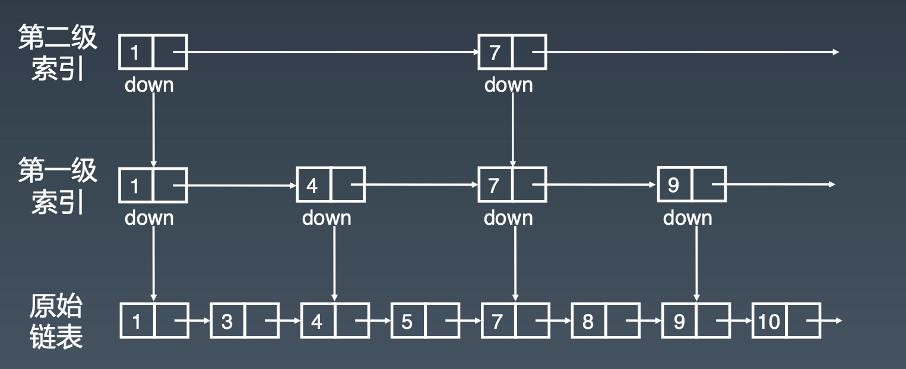
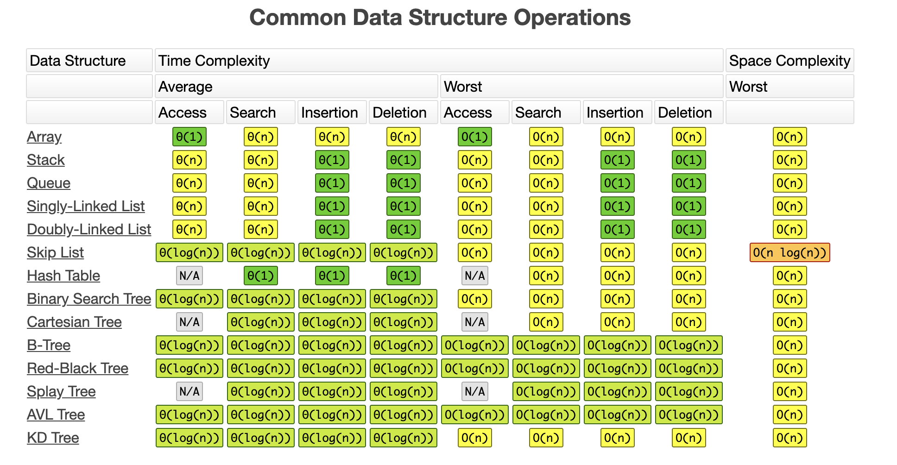
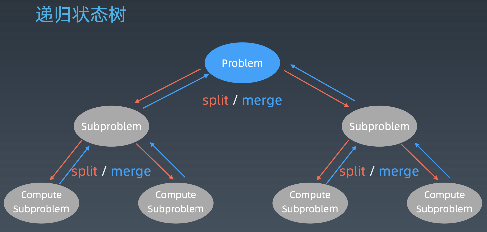

# 算法训练营学习笔记

## 目录

[TOC]


## Week 1# 学习笔记

### 数组 Array

**Java、C/C++ 实现**

```C
int arr[10];
```

**Python 实现**

```python
arr = []
arr = List()
```

**JavaScript 实现**

```javascript
let arr = [1,2,3]
```

##### 特点

- 数组的内存空间是连续的
- 数组可以随机的访问任何一个位置的元素，时间为常数 $O(1)$
- 插入元素（Insert）和删除元素（Delete）的时间是 $O(n)$
- 前增元素（prepend）和后增元素（append）时间为$O(1)$ 
  - 正常情况下的prepend操作时间应为$O(n)$，但是可以通过优化到$O(1)$：申请一个稍大的空间，在数组的最开始预留一部分空间，prepend操作则是把头下标前移一个位置即可

##### 参考链接

[Java 源码分析（ArrayList）](http://developer.classpath.org/doc/java/util/ArrayList-source.html)


### 链表 Linked List

**使用情况：**在需要频繁插入/删除元素时，数组并不适用，因此需要**链表（*Linked List*）**这个数据结构。

##### 结构

- 值 Value

- 指针 Next

```java
/* java 源码实现 */
class LinkedList {
  Node head; // head of first
  
  /* Linked List Node */
  class Node {
    int data;
    Node next;
    
    // Constructor to create a new node
    // Next is by default initialised as null
    Node(int d) { data = d; }
  }
}
```

一般头指针为 `head` 尾指针为`tail`


##### 双向链表

即有两个指针，分别指向前一个元素（Prev）和后一个元素（Next）

##### 循环链表

当`tail` 的 next 指针指向 `head` ，即 `tail.next == head` ，为循环链表

##### 操作

- **插入/删除：**时间为$O(1)$
- **前增/后增：**$O(1)$
- **查询：**$O(n)$

##### 参考链接

[Linked List 的标准实现代码](http://www.geeksforgeeks.org/implementing-a-linked-list-in-java-using-class/)

[Java 源码分析（LinkedList）](http://developer.classpath.org/doc/java/util/LinkedList-source.html)


### 跳表 Skip List

**跳表（Skip List）**是（只能）对**有序链表**进行的查询优化，对标的是平衡树（AVL Tree）和二分查找（Binary Search），1989年出现。其查询/插入/删除操作时间复杂度均为$O(\log n)$。优势：原理简单，容易实现，方便扩展，效率更高。因此在一些热门的项目里用来代替平衡树，如 Redis，LevelDB 等。

##### 一维的数据结构的加速通常采用升维的方式

思想：**空间换时间**

##### 添加索引



##### 时间复杂度分析

- 一级索引：$\dfrac{n}{2}$

- 二级索引：$\dfrac{n}{4}$

- $k$ 级索引：$\dfrac{n}{2^k}$
- 假设索引有 $h$ 级，最高级有2个结点，$\dfrac{n}{2^h} = 2$，从而求得 $h = \log 2n - 1$
- 即 $O(\log n)$
- 维护成本高，**空间复杂度**为 $O(n)$

##### 应用及参考链接

LRU Cache - Linked List：[LRU 缓存机制](http://leetcode-cn.com/problems/lru-cach)

Redis - Skip List：[跳跃表](http://redisbook.readthedocs.io/en/latest/internal-datastruct/skiplist.html)、[为啥 Redis 使用跳表（Skip List）而不是使用 Red-Black？](http://www.zhihu.com/question/20202931)


### 栈和队列 Stack and Queue

**栈（*stack*）**是**先入后出**结构（First In Last Out/ Last In First Out），**队列（*Queue*）**是**先入先出**结构（First In First Out）

##### 操作

- **查询：**$O(n)$
- **插入/删除：**$O(1)$

##### 栈的API（Java）

```java
Class Stack<E>
/* java 官方文档给出，工程中要使用栈，不推荐使用stack，而是用deque来实现栈 */
Deque<Integer> stack = new ArrayDeque<Integer>();

stack.empty();								// 返回值为 boolean，判断栈是否为空
stack.peek();									// E，返回栈顶元素的值（不删除栈定元素）
stack.pop();									// E，弹出并返回栈顶元素的值（会删除栈定元素）
stack.push(E item);						// E，向栈中压入元素
stack.search(Object o);				// int，查询并返回查询到的元素下标（位置）

```

##### 队列的API（Java）

```java
/* Queue并不是一个Class（类）而是一个Interface（接口） */
Interface Queue<E>

```

| Operation   | Throws exception（抛出异常） | Returns special value（返回特殊值） |
| ----------- | ---------------------------- | ----------------------------------- |
| **Insert**  | `add(e)`                     | `offer(e)`                          |
| **Remove**  | `remove()`                   | `poll()`                            |
| **Examine** | `element()`                  | `peek()`                            |

##### 参考链接

[Java 的 Stack 源码](http://developer.classpath.org/doc/java/util/Stack-source.html)

[Java 的 Queue 源码](http://fuseyism.com/classpath/doc/java/util/Queue-source.html)


### 双端队列 Deque (Double-End Queue)

**双端队列（*Deque*）**是两端可以进出的**Queue**

##### 操作

- **查询：**$O(n)$
- **插入/删除：**$O(1)$

##### 双端队列的API

```java
/* Deque也是一个Interface（接口） */
Interface Deque<E>
```


##### 与栈和队列的对比


##### 搜索文档方法

功能 语言 版本 e.g. `stack java 12`


### 优先级队列 Priority Queue

##### 操作

- **插入：**$O(1)$
- **取出：**$O(\log n)$ 按照元素优先级取出

##### 参考链接

[Java 的 PriorityQueue 文档](http://docs.oracle.com/javase/10/docs/api/java/util/PriorityQueue.html)

**python：**

[Python 的 heapq](http://docs.python.org/2/library/heapq.html)

[高性能的 container 库](http://docs.python.org/2/library/collections.html)


### 哈希表

**哈希表（*Hash Table*）**也叫**散列表**，是根据**关键码值（*Key Value*）**直接进行访问的结构，它通过把 Key Value 映射到表中的一个位置来访问记录，以加快查找速度，这样的一个函数叫做**散列函数（*Hash Function*）**，存放记录的数组则为哈希表

##### 实践

- 用户信息表
- 缓存（LRU Cache）
- 键值对存储（Redis）

##### 哈希碰撞（Hash Collision）

两个不同的元素映射到同一个位置，则为哈希碰撞


### 映射 Map 和 集合Set

##### Map

Key-Value对，Key不重复

```java
HashMap<Integer, Integer> map = new HashMap(Integer, Integer);		// 或用new TreeMap();

map.set(key, value);
map.get(key);
map.has(key);
map.size();
map.clear();
```

##### Set

不重复元素的集合，即Value不重复

```java
Set<Integer> set = new HashSet<Integer>();											// 或用new TreeSet();

set.add(value);
set.delet(value);
set.hash(value);
```

##### 参考链接

[Java Set 文档](http://docs.oracle.com/en/java/javase/12/docs/api/java.base/java/util/Set.html)

[Java Map 文档](http://docs.oracle.com/en/java/javase/12/docs/api/java.base/java/util/Map.html)


### 常用数据结构操作的复杂度表




## Week 2# 学习笔记

### 树

当链表有多个`Next`指针，则为**树（*Tree*）**，即链表是特殊化的树。树是没有环的图（Graph），即树是特殊化的图


### 二叉树 Binary Tree

是每个节点最多只有两个分支（即不存在分支度大于2的节点）的树结构。通常分支被称作“**左子树**”或“**右子树**”。二叉树的分支具**有左右次序**，不能随意颠倒。

#### 示例代码

```Python
# Python
class TreeNode:
  def __init__(self, val):
    self.val = val
    self.left = None
    self.right = None
```

```C++
// C++
struct TreeNode {
  int val;
  TreeNode *left;
  TreeNode *right;
  TreeNode(int x): val(x), left(NULL), right(NULL) {}
}
```

```Java
// Java
public class TreeNode {
  public int val;
  public TreeNode left, right;
  public TreeNode(int val) {
    this.val = val;
    this.left = null;
    this.right = null;
  }
}
```

#### 遍历

##### 前序遍历  Pre-order

- **顺序**：根-左-右

- **代码**：

```Python
def preorder(self, root: TreeNode):
  if root:
    self.traverse_path.append(root.val)
    self.preorder(root.left)
    self.preorder(root.right)
```

##### 中序遍历 In-order

- **顺序**：左-根-右

- **代码**：

```Python
def inorder(self, root: TreeNode):
  if root:
    self.preorder(root.left)
    self.traverse_path.append(root.val)
    self.preorder(root.right)
```

##### 后序遍历 Post-order

- **顺序**：左-右-根

- **代码**：

```Python
def postorder(self, root: TreeNode):
  if root:
    self.preorder(root.left)
    self.preorder(root.right)
    self.traverse_path.append(root.val)
```


### 二叉搜索树 Binary Search Tree

二叉搜索树，也称二叉排序树、有序二叉树（Ordered Binary Tree）、排序二叉树（Sorted Binary Tree），是指一棵**空树**或者具有下列性质的二叉 树:

- 左子树上的**所有节点**的值均小于其根节点的值
- 右子树上的**所有节点**的值均大于其根节点的值
- 左、右子树也是二叉搜索树

**特点：**中序遍历结果升序排列

**操作：**[Demo](https://visualgo.net/zh/bst)

- 查询：$O(\log n)$
- 插入：$O(\log n)$
- 删除：$O(\log n)$


### 堆 Heap

可以迅速找到一堆数中的**最大值**或**最小值**的数据结构（不能同时找最大和最小）

- 根节点最大的堆叫做**大顶堆**或**大根堆**

- 根节点最小的对焦作**小顶堆**或**小根堆**


该数组从逻辑上讲就是一个堆结构，我们用简单的公式来描述一下堆的定义就是：

**大顶堆：arr[i] >= arr[2i+1] && arr[i] >= arr[2i+2]**  

**小顶堆：arr[i] <= arr[2i+1] && arr[i] <= arr[2i+2]**  


**大顶堆（小顶堆类似）的常见操作（API）**：

`find-max`			  	$O(1)$

`delete-maxt`	   	$O(\log N)$

`insert(create)`	$O(\log N)$ or $O(1)$


**不同实现的比较**


### 二叉堆 Binary Heap

通过**完全二叉树**来实现（实现较容易，但是性能表现一般）

**注：二叉堆是堆（优先队列 Priority Queue）的一种常见且简单的实现，单并不是最优的实现**

#### 性质

1. 是一颗完全树
2. 树中任意结点的值总是 $\geq$ 其子结点的值

#### 实现

1. 一般通过**数组**来实现

2. 假设第一个元素（根结点）在数组的索引为`0`，则父结点和子结点的位置关系如下：

   - 索引为 `i` 的左孩子的索引是 `(2*i+1)​`
   - 索引为 `i` 的右孩子的索引是 `(2*i+1)`
   - 索引为 `i​` 的父结点的索引是 `floor((i-1)/2)`

   

#### 操作

##### 插入 Insert 

时间复杂度： $O(\log N)$

1. 新元素一律先插入到堆尾
2. Heapifyup：依次向上调整整个堆堆结构（与父结点比较及交换，直到根）

```Java
// Java 部分代码
/**
	*	Insert new element into heap
	* Complexity: O(log N)
	* As worst case scenario, we need to traverse till the root
	*/
public void insert(int x) {
  if (isFull()) {
    throw new NoSuchElementException("Heap is full. No space to insert new element");
  }
  heap[heapSize++] = x;
  heapifyUp(heapsize - 1);
}

/**
	* Maintains the heap property while inserting an element
	*/
private void heapifyUp(int i) {
  int insertValue = heap[i];
  while (i > 0 && insertValue > head[parent(i)]) {
    heap[i] = heap[parent(i)];
    i = parent(i);
  }
  heap[i] = insertValue;
}
```

##### 删除 Delete

时间复杂度： $O(\log N)$

1. 将堆尾元素替换到顶部（即堆顶被替代删除）
2. HeapifyDown：依次从根向下调整整个堆堆结构（与左右孩子结点比较，与较大的子结点交换，直到叶子）

```Java
/**
	*	Delete element at index x
	* Complexity: O(log N)
	*/
public int delete(int x) {
  if (isEmpty()) {
    throw new NoSuchElementException("Heap is empty. No element to delete");
  }
  int key = heap[x];
  heap[x] = heap[heapSize - 1];
  heapSize--;
  heapifyDown(x);
  return key
}

/**
	* Maintains the heap property while deleting an element
	*/
private void heapifyDown(int i) {
  int child;
  int temp = heap[i];
  while (kthChild(i, 1) < heapSize) {
    child = maxChild(i);
    if (temp >= heap[child]){
      break;
    }
    heap[i] = heap[child];
    i = child;
  }
  heap[i] = temp;
}
```


### 堆排序 Heap Sort

**堆排序（*Heap Sort*）**是基于二叉堆数据结构的一种比较排序，它与**选择排序（*Selection Sort*）**相似，即找到最大值并将其置于末端。

##### 升序排列

1. 构建大顶堆
2. 此时大顶堆堆根结点为最大值，将其与堆的最后一个结点交换，将堆的大小减一（即将除最大值外的其他结点作为新的堆），将新堆重新堆化（Heapify）为大顶堆
3. 重复上述操作，最终可以得到一个升序数组

##### 降序排列

1. 构建小顶堆
2. 此时小顶堆堆根结点为最小值，将其与堆的最后一个结点交换，将堆的大小减一（即将除最小值外的其他结点作为新的堆），将新堆重新堆化（Heapify）为小顶堆
3. 重复上述操作，最终可以得到一个降序数组

##### 特点

1. 堆排序是原地算法（in-place algorithm）
2. 不稳定

##### 时间复杂度

堆化操作`heapify` 为 $O(\log N)$，创建堆的操作为 $O(N)$，堆排序的整体操作为 $O(N \log N)$

##### 代码实现

```Python
# Python program for implementation of heap Sort 

# To heapify subtree rooted at index i. 
# n is size of heap 
def heapify(arr, n, i): 
	largest = i # Initialize largest as root 
	l = 2 * i + 1	 # left = 2*i + 1 
	r = 2 * i + 2	 # right = 2*i + 2 

	# See if left child of root exists and is 
	# greater than root 
	if l < n and arr[i] < arr[l]: 
		largest = l 

	# See if right child of root exists and is 
	# greater than root 
	if r < n and arr[largest] < arr[r]: 
		largest = r 

	# Change root, if needed 
	if largest != i: 
		arr[i],arr[largest] = arr[largest],arr[i] # swap 

		# Heapify the root. 
		heapify(arr, n, largest) 

# The main function to sort an array of given size 
def heapSort(arr): 
	n = len(arr) 

	# Build a maxheap. 
	for i in range(n//2 - 1, -1, -1): 
		heapify(arr, n, i) 

	# One by one extract elements 
	for i in range(n-1, 0, -1): 
		arr[i], arr[0] = arr[0], arr[i] # swap 
		heapify(arr, i, 0) 

# Driver code to test above 
arr = [ 12, 11, 13, 5, 6, 7] 
heapSort(arr) 
n = len(arr) 
print ("Sorted array is") 
for i in range(n): 
	print ("%d" %arr[i]), 
# This code is contributed by Mohit Kumra 

```


### 图 Graph

#### 属性和分类

**图（*Graph*）**由**点（*Vertices*）**和**边（*Edges*）**组成。

##### 属性

- Graph $(V, E)$
- $V$ - vertex 点
  - 度（Degree）：入度/出度
  - 连通/非联通
- $E$ - Edge 边
  - 有向/无向
  - 权重

##### 图的表示

- 邻接矩阵（Adjacency Matrix）
- 邻接表（Adjacency List）

##### 图的分类

1. **无向无权图：**邻接矩阵是对称的，且值（权重）为0或1
2. **有向无权图：**邻接矩阵不对称，值（权重）为0或1。
3. **无向有权图：**邻接矩阵是对称的，值即权重
4. **有向有权图：**邻接矩阵不对称，值为权重

#### 图的算法

##### DFS

**代码：递归**

```Python
visited = set() 			 	# 和树中的DFS最大区别，因为树没有环路

def dfs(node, visited):
  if node in visited:  	# Terminator
    return							# Already visited
  visited.add(node)
  
  # Process current node here.
  
  for next_node in node.children():
    if not next_node in visited:
      dfs(next_node, visited)
```

##### BFS

**代码：**

```Python
def bfs(graph, start, end):
  queue = []
  queue.append([start])
  
  visited = set						# 和树中的DFS最大区别，因为树没有环路
  
  while queue:
    node = queue.pop()
    visited.add(node)
    
    process(node)
    nodes = generate_related_nodes(node)
    queue.push(nodes)
```

##### 高级算法

- [连通图个数](http://leetcode-cn.com/problems/number-of-islands/)
- [拓扑排序（Topological Sorting）](http://zhuanlan.zhihu.com/p/34871092)
- [最短路径（Shortest Path）：Dijkstra](http://www.bilibili.com/video/av25829980)
- [最小生成树（Minimum Spanning Tree）](http://www.bilibili.com/video/av84820276)（推荐B站：花花酱 的视频）


### 递归 Recursion

对于树来说，因为树的节点是以递归的方式来定义的，且具有重复性（自相似性），因此树的大部分算法都是可以用递归的

**递归（*Recursion*）**本质上是一种循环，是通过函数体（调用自身）来实现循环

##### 特点：

- 遇到递归调用时，向下进入下一层（一般会传入新参数）
- 当前层结束后，向上返回上一层，并继续运行
- 每一层的局部变量（传入的参数以外）都是一份拷贝，不会对回归过程产生影响

**示例：Factorial 阶乘实现**

```Python
def factorial(n):
    if n <= 1:
      return 1
  	return n * factorial(n-1)
```

##### 代码模版 Python

```Python
def recursion(level, param1, param2, ...):
    # Recursion terminator
    if level > MAX_LEVEL:
      precess_result
      return
    
    # Process logic in current level
    process(level, data, ...)
    
    # Drill down
    self.recursion(level+1, newparam, ...)
    
    # Reverse the current level status if needed
    
```

[其他语言版本](https://shimo.im/docs/EICAr9lRPUIPHxsH/read)

##### 思维要点

1. 不要人肉递归（最大误区）
2. 找最近重复子问题
3. 数学归纳法思维


## Week 3# 学习笔记

### 分治和回溯 Divide & Conquer/ Backtracking

本质上是递归



#### 分治

##### 代码模版

```Python
# Python
def divide_conquer(problem, param1, param2, ...): 
  # recursion terminator 
  if problem is None: 
	print_result 
	return 

  # prepare data 
  data = prepare_data(problem) 
  subproblems = split_problem(problem, data) 

  # conquer subproblems 
  subresult1 = self.divide_conquer(subproblems[0], p1, ...) 
  subresult2 = self.divide_conquer(subproblems[1], p1, ...) 
  subresult3 = self.divide_conquer(subproblems[2], p1, ...) 
  …

  # process and generate the final result 
  result = process_result(subresult1, subresult2, subresult3, …)
	
  # revert the current level states
```

[其他语言版本代码版本](https://shimo.im/docs/zvlDqLLMFvcAF79A/)

#### 回溯 

采用**试错思想**，尝试**分步**地去解决一个问题。在分步解决问题的过程中，当它通过尝试发现现有的分步答案不能得到有效的正确的解答的时候，将取消上一步甚至上几步的计算，再通过其他的可能的分步解答再次尝试寻找问题的答案。

常采用最简单的递归方法实现，在反复重复上述步骤后可能出现：

- 找到一个可能存在的正确的答案
- 尝试了所有可能的分步方法后宣告该问题没有答案

最坏的情况下，回溯法会导致一次复杂度为指数时间的计算


### 深度优先搜索 DFS (Depth-First-Search)

##### 代码模版

```python
# 递归
visited = set() 

def dfs(node, visited):
    if node in visited: # terminator
    	# already visited 
    	return 

	visited.add(node) 

	# process current node here. 
	# ...
	for next_node in node.children(): 
		if next_node not in visited: 
			dfs(next_node, visited)


# 非递归 维护一个栈
def dfs(self, tree): 

	if tree.root is None: 
		return [] 

	visited, stack = [], [tree.root]

	while stack: 
		node = stack.pop() 
		visited.add(node)

		process(node) 
		nodes = generate_related_nodes(node) 
		stack.push(nodes) 

	# other processing work 
	# ...
```

[DFS 代码模板（递归写法、非递归写法）](https://shimo.im/docs/UdY2UUKtliYXmk8t/)


### 广度优先搜索 BFS (Breadth-First-Search )

##### 代码模版

```python
def bfs(graph, start, end):
    visited = set()
	queue = [] 
	queue.append([start]) 
	while queue: 
		node = queue.pop() 
		visited.add(node)
		process(node) 
		nodes = generate_related_nodes(node) 
		queue.push(nodes)
	# other processing work 
	...
```

[BFS 代码模板](https://shimo.im/docs/ZBghMEZWix0Lc2jQ/)


### 贪心算法 Greedy Algorithm

**贪心算法（*Greedy Algorithm*）**是一种在每一步选择中都采取在当前状态下最好或最优的选择，从而希望导致结果是**全局最好或最优**的算法。

**与动态规划不同的是**，它对每个子问题的解决方案都做出（最优）选择，**不能回退**。

动态规划则会保存以前的运算结果，并根据以前的结果对当前进行选择，能回退


贪心算法可以解决一些最优化问题，如：求图中的最小生成树、求哈夫曼编码等。但工程中一般不能得到全局最优的答案。

> 一旦一个问题可以用贪心算法来解决，那么贪心算法一般是解决这个问题的最好办法。由于贪心算法的高效性以及其所求得的答案比较接近最优结果，贪心算法也可以用作辅助算法或者直接解决一些要求结果不特别精确的问题。


##### 适合贪心算法的场景

问题能分解成子问题来解决，子问题的最优解能递推到最终问题的最优解。这种子问题最优解称为**最优子结构**


### 二分查找 Binary Search

##### 前提

1. 目标函数具有**单调性**
2. 存在**上下界**
3. 能够通过**索引访问**

##### 代码模版

```python
# Python
left, right = 0, len(array) - 1 
while left <= right: 
	  mid = (left + right) / 2 
	  if array[mid] == target: 
		    # find the target
		    break or return result 
	  elif array[mid] < target: 
		    left = mid + 1 
	  else: 
		    right = mid - 1
```

[二分查找其他语言代码模板](https://shimo.im/docs/xvIIfeEzWYEUdBPD/)

#### 牛顿迭代法

在迭代过程中，以**直线代替曲线**，用一阶泰勒展开式（即在当前点的切线）代替原曲线，求直线与 $x$ 轴的交点，重复这个过程直到收敛


## Week 4# 学习笔记

### 动态规划 Dynamic Programming

#### 概念思想

**思想**：（递归地）将一个复杂的问题分解成较为简单的子问题

**分治（*Divide & Conquer*） + 最优子结构（*Optimal substructure*）**


动态规划和递归或者分治**没有根本上的区**别（关键看有无最优子结构）

**共性**：找到重复子问题

**差异性**：（DP）最优子结构、中途可以淘汰次优解


具有最优子结构性质以及重叠子问题性质的问题可以通过动态规划求解。

##### 最优子结构

- 如果一个问题的最优解包含其子问题的最优解，我们就称此问题具有**最优子结构**。
- 一个问题具有最优子结构，可能使用动态规划方法，也可能使用贪心方法。所以最优子结构只是一个线索，不是看到有最优子结构就一定是用动态规划求解

##### 重叠子问题

- 子问题空间必须足够“小”，即在不断的递归过程中，是在反复求解大量相同的子问题，而不是每次递归时都产生新的子问题。
- 一般的，不同子问题的总数是输入规模的多项式函数为好
- 如果递归算法反复求解相同的子问题，我们就称最优化问题具有重叠子问题性质

##### 从分治到动态规划

对于**分治**解法，我们的计算过程分为两个阶段：

1. 递归的不断的分解问题，直到问题不可继续分解。
2. 当问题不可继续分解，也就是分解到最小子问题后，由最小子问题的解逐步向上回归，逐层求出上层问题的解。

阶段1我们称为**递归过程**，而阶段2我们称为递归调用的**回归过程**。我们要做的，就是省略递归分解子问题的过程，将阶段2用递推实现出来。 


#### 方法

##### 三步思维要点

1. 化繁为简（拆分子问题）
2. 定义状态空间
3. DP 方程

##### 5 "Easy" steeps to DP:

1. define subprolems
2. guess (part of solution) 
3. relate subproblem solutions
4. recurse & memorize  OR  build DP table bottom-up
5. solve original problem


#### 小结

1. 打破思维惯性，形成机器思维（找重复性）
2. 理解复杂逻辑的关键

推荐B站：[MIT 动态规划课程](https://www.bilibili.com/video/av53233912?from=search&seid=2847395688604491997)


## Week 5# 学习笔记

### 字典树 Trie 和 并查集Disjoint Set

#### 字典树 Trie

##### 概念

又称**单词查找树**或**键树**，是一种树形结构。典型应用于统计和排序大量的字符串（但不仅限于字符串）

##### 优点

最大限度地减少无谓的字符串比较，查询效率比哈希表高

##### 核心思想

空间换时间

利用字符串的公共前缀来降低查询时间的开销以提高查询效率

##### 性质

1. 结点本身不存完整单词
2. 从根结点到某一结点路径上的所有字符连接起来，为该结点对应的字符串
3. 每个结点的所有子结点路径代表的字符都不相同

##### 代码模版

```python
class Trie(object):
  
		def __init__(self): 
				self.root = {} 
				self.end_of_word = "#" 
 
		def insert(self, word): 
				node = self.root 
				for char in word: 
						node = node.setdefault(char, {}) 
				node[self.end_of_word] = self.end_of_word 
 
		def search(self, word): 
				node = self.root 
				for char in word: 
						if char not in node: 
								return False 
						node = node[char] 
				return self.end_of_word in node 
 
		def startsWith(self, prefix): 
				node = self.root 
				for char in prefix: 
						if char not in node: 
							return False 
						node = node[char] 
				return True
```

[其他语言代码模版](https://shimo.im/docs/DP53Y6rOwN8MTCQH/read)

#### 并查集Disjoint Set

##### 适用场景

组团、配对问题

##### 基本操作

- `__init__(n)`：建立一个新的并查集，其中包含 `n` 个单元素集合
- `union(p, q)`：把元素 `p` 和元素 `q` 所在的集合合并，要求 `p` 和 `q` 所在的集合不相交，如果相交则不合并
- `find(x)`：找到元素 `x` 所在的集合的代表，该操作也可以用于判断两个元素是否位于同一个集合，只要将它们各自的代表比较一下就可以了。

##### 代码模版

```python
class UnionFind:
		def __init__(self, n): 
				self.parent = [i for i in range(n)]
 
		def union(self, p, q): 
				pRoot = self.find(p) 
				qRoot = self.find(q)
        if pRoot != qRoot:
					self.parent[pRoot] = qRoot
 
		def find(self, x): 
				root = x
				while self.parent[root] != root: 
          	self.parent[root] = self.parent[self.parent[root]]
						root = self.parent[root] 
				return root
```

[其他语言代码模版](https://shimo.im/docs/VtcxL0kyp04OBHak/read)


### AVL 和 红黑树

#### AVL

##### 概念

一般的二叉查找树的查询复杂度取决于目标结点到树根的距离（即深度），因此当结点的深度普遍较大时，查询的均摊复杂度会上升。为了实现更高效的查询，产生了平衡树。

AVL 是一种**自平衡二叉查找树**，得名于其发明者 G. M. Adelson-Velsky和 Evgenii Landis

**平衡因子：**是它的左子树的高度减去它的右子树的高度(有时相反)。 $BalanceFactor=\{-1, 0, 1\}$

##### 平衡方法：旋转操作

1. 左旋
2. 右旋
3. 左右旋
4. 右左旋


**不足**：结点需要存储额外信息、且调整次数频繁

#### 红黑树 Red Black Tree

##### 概念

红黑树是一种近似平衡的二叉搜索树（Binary Search Tree），它能够确保任何一个结点的左右子树的高度差小于两倍。

##### 性质

- 每个结点要么是红色，要么是黑色
- 根结点是黑色
- 每个叶结点(NIL结点，空结点)是黑色的。
- 不能有相邻接的两个红色结点
- 从任一结点到其每个叶子的所有路径都包含相同数目的黑色结点。

##### 特点

从根到叶子的最长的可能路径不多于最短的可能路径的两倍长。


### 位运算

对位模式或二进制数的一元和二元操作。在现代架构中，位运算的运算速度通常与加法运算相同，通常比乘除法运算要快。

#### 位运算符

| 含义         | 运算符 | 示例                    |
| ------------ | ------ | ----------------------- |
| 按位或 OR    | `|`    | `0011 ｜ 1001 -> 1011 ` |
| 按位与 AND   | `&`    | `0011 & 1001 -> 0001 `  |
| 按位取反 NOT | `~`    | `~0011 -> 1100 `        |
| 按位异或 XOR | `^`    | `0011 ^ 1001 -> 1010 `  |
| 左移         | `<<`   | `0011 << 1 -> 0110 `    |
| 右移         | `>>`   | `0011 >> 1 -> 0001 `    |

##### 异或 XOR 的特点

`x ^ 0 == x`

`x ^ 1s == ~x # 1s即 ~0` 

`x ^ (~x) == 1s`

`x ^ x == 0`

交换：`c == a ^ b` <=> `b == a ^ c`  <=> `a == b ^ c`

结合：`a ^ b ^ c <=> a ^ (b ^ c) <=> (a ^ b) ^ c`

#### 指定位置的位运算

1. 将 `x` 最右边的 `n` 位清零：`x & (~0 << n)`
2. 获取 `x` 的第 `n` 位的值：`(x >> n) & 1`
3. 获取 `x` 的第 `n` 位的幂值：`x & (1 << n) `
4. 将第 `n` 位置 `0`：`x & (~(1 << n))`
5. 将第 `n` 位置 `1`：`x | ((1 << n))`
6. 将 `x` 的最高位至第 `n` 位（含）清零：`x & ((1 << n) - 1)`

#### 实战要点

- 判断奇偶 `n % 2` 等价于 `n & 1`
  - 奇数 `n & 1 == 1`
  - 偶数 `n & 1 == 0`

- `x // 2` 等价于 `x >> 1` （向下取整）
- `x = x & (x - 1)` 清除最低位的 `1`
- `x & (-x)` 得到最低位的 `1`
- `-x == ~x + 1 ` 取反加一为相反数

